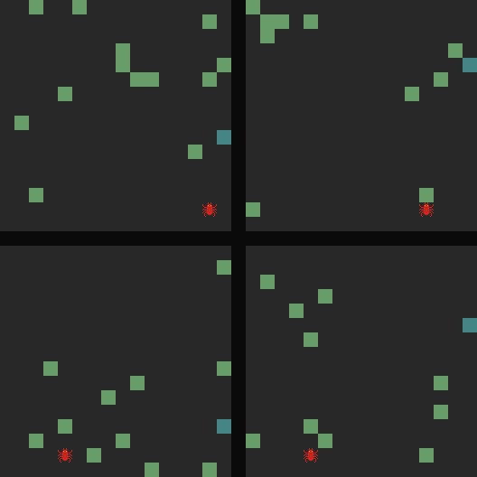

# Fim

Fim is a 2D puzzle game with random-generated maps and parallel worlds.

Written in C with the SDL2 library.



## Features
- [x] Basic graphics
- [x] Generate random solvable maps
- [x] Increase complexity as player proceeds
- [x] Solve multiple maps in parallel
- [ ] Simple UI with game info as the player progresses
- [ ] Generate maps in parallel using threads

## Ships with
- `cmocka` unit test framework
- `gcov` coverage testing
- `doxygen` documentation generation
- `astyle` automatic code formatting

## Dependencies
- `gcc`
- `make`
- `sdl2` and `sdl2_image` library
- `meson` (optional)

Or check the `Dockerfile` for exact dependencies (in ubuntu).

## Build
```
make all
```

or
```
meson build
cd build
ninja
```

followed by
```
./fim
```

## Test
```
make test
make covr
```

or
```
meson build
cd build
ninja test
cat meson-logs/testlog.txt
```
