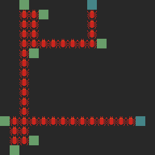
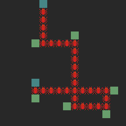
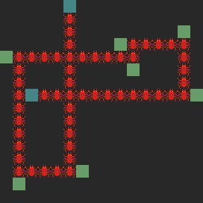

# Fim

Fim is a 2D puzzle game with random-generated maps and parallel worlds.

Written in C with the SDL2 library

## Features
- [x] Basic graphics
- [x] Generate random solvable maps
- [ ] Increase complexity as player proceeds
- [ ] Solve multiple maps in parallel

## Ships with
- `cmocka` unit test framework
- `gcov` coverage testing
- `doxygen` documentation generation
- `astyle` automatic code formatting

## Dependencies
- `gcc`
- `make`
- `sdl2` and `sdl2_image` library

### June 2018 - v1.0.0

### Versioning
Fim uses [Semantic Versioning](https://semver.org/) for versions and releases.

MAJOR.MINOR.PATCH
